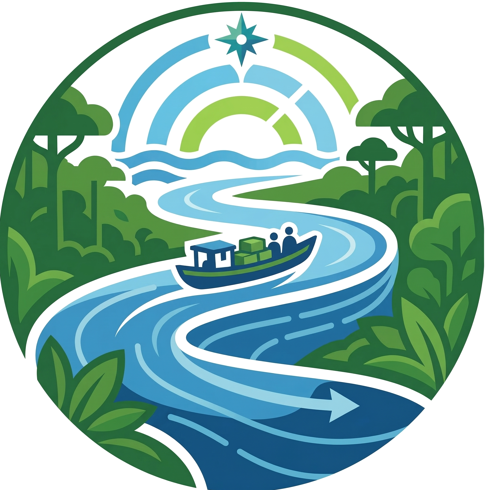

Tama Hidrovias – Plataforma de Previsão Hidrológica
====================================================

.. image:: https://img.shields.io/badge/license-MIT-blue.svg
   :target: LICENSE

**Tama Hidrovias** é uma plataforma integrada de previsão hidrológica para a
região dos rios Madeira e Tapajós, focada no monitoramento de hidrovias e
gestão de recursos hídricos. O sistema processa dados climáticos, recorta
regiões hidrográficas específicas e serve camadas raster interativas para
visualização em mapas hidrográficos brasileiros. A plataforma combina dados de
reanálise climática, processamento geoespacial em Python, uma API headless
Strapi, visualização interativa com Next.js e serviço de camadas raster via
TileServer-GL.

.. contents:: Conteúdo
   :depth: 2
   :local:

Arquitetura
-----------

.. code-block:: text

    ┌──────────────────────────────────────────────────────────┐
    │                     Fontes de Dados                      │
    │         Remote Repository  ·  Shapefiles                 │
    └───────────────────────┬──────────────────────────────────┘
                            │
                            ▼
    ┌───────────────────────────────────────┐
    │         Python Worker (pipeline)      │
    │  · Download                           │
    │  · Recorte  (GDAL/Shapely)            │
    │  · Geração de GeoTIFF / NetCDF        │
    │  · Publicação via API REST → Strapi   │
    └───────────┬───────────────────────────┘
                │                   │
                ▼                   ▼
    ┌───────────────────┐  ┌────────────────────┐
    │   Strapi (API)    │  │  TileServer-GL     │
    │   porta 1337      │  │  porta 8080        │
    │   PostgreSQL 15   │  │  GeoTIFF → XYZ/PNG │
    └─────────┬─────────┘  └────────┬───────────┘
              │                     │
              └──────────┬──────────┘
                         ▼
              ┌────────────────────┐
              │   Next.js (UI)     │
              │   porta 3000       │
              │   Mapbox GL JS     │
              └────────────────────┘

Estrutura do Repositório
------------------------

O repositório raiz funciona como camada de orquestração. As aplicações
executáveis vivem nos diretórios de serviço:

.. code-block:: text

    tama-hidrovias/
    ├── web/           # frontend
    ├── cms/           # CMS e API
    ├── pipeline/      # pipeline de dados e testes
    ├── tileserver/    # serviço de tiles raster
    ├── data/          # dados locais brutos e processados
    ├── docs/          # documentação Sphinx
    ├── assets/        # branding compartilhada (fonte canônica)
    ├── CONTRIBUTING.md
    └── docker-compose.yml

Início Rápido com Docker
-------------------------

.. code-block:: bash

    # 1. Clone e configure variáveis de ambiente
    cp .env.example .env
    # Edite .env com seus tokens e chaves

    # 2. Suba todos os serviços
    docker compose up --build -d

    # 3. Acesse a plataforma
    # Frontend:    http://localhost:3000
    # API Strapi:  http://localhost:1337/admin
    # TileServer:  http://localhost:8080

Serviços
--------

+----------------+-------+---------------------------------------------------+
| Serviço        | Porta | Descrição                                         |
+================+=======+===================================================+
| ``web``        | 3000  | Interface web com mapas interativos (Mapbox GL)   |
+----------------+-------+---------------------------------------------------+
| ``strapi``     | 1337  | API headless REST/GraphQL + painel de administração|
+----------------+-------+---------------------------------------------------+
| ``tileserver`` | 8080  | Servição de camadas raster GeoTIFF via TileJSON   |
+----------------+-------+---------------------------------------------------+
| ``postgres``   | 5432  | Banco de dados PostgreSQL 15                      |
+----------------+-------+---------------------------------------------------+
| ``python-worker`` | –  | Pipeline de dados (sem porta exposta)             |
+----------------+-------+---------------------------------------------------+

Pipeline Python
---------------

O worker Python executa as seguintes etapas automaticamente:

1. **Download** de dados (com variáveis hidrológicas) via ``cdsapi``
2. **Recorte espacial** da bacia hidrográfica usando o shapefile configurado em
   ``BASIN_SHAPEFILE``
3. **Conversão** NetCDF → GeoTIFF com reprojeção para EPSG:4326
4. **Publicação** dos metadados e caminhos de arquivo na API Strapi
5. Os GeoTIFFs ficam disponíveis em ``./data/geotiffs/`` para o TileServer-GL

Para rodar o pipeline manualmente:

.. code-block:: bash

    docker compose run --rm python-worker

Configuração para Desenvolvimento
-----------------------------------

Python
~~~~~~

.. code-block:: bash

    cd pipeline
    python -m venv .venv
    source .venv/bin/activate
    pip install -r requirements.txt
    pip install -e .
    pytest

Next.js
~~~~~~~

.. code-block:: bash

    cd web
    npm install
    npm run dev        # http://localhost:3000

Strapi
~~~~~~

.. code-block:: bash

    cd cms
    npm install
    npm run develop    # http://localhost:1337/admin

Estrutura de Dados
------------------

.. code-block:: text

    data/
    ├── geotiffs/          # Rasters processados (montados no TileServer)
    ├── shapefiles/        # Shapefile da bacia hidrográfica
    │   └── basin.shp
    ├── raw/               # NetCDF brutos baixados do ERA5
    └── processed/         # Dados intermediários / CSVs

.. note::
   Os arquivos de dados são ignorados pelo Git (ver ``.gitignore``).
   Apenas a estrutura de diretórios é versionada via arquivos ``.gitkeep``.

Variáveis de Ambiente
---------------------

Arquivos recomendados por contexto:

- ``/.env.example``: variáveis compartilhadas usadas pelo ``docker compose``
- ``web/.env.example``: desenvolvimento isolado do frontend
- ``cms/.env.example``: desenvolvimento isolado do Strapi

Copie o arquivo apropriado para ``.env`` e preencha os valores:

.. list-table::
   :header-rows: 1
   :widths: 30 70

   * - Variável
     - Descrição
   * - ``POSTGRES_PASSWORD``
     - Senha do banco de dados PostgreSQL
   * - ``APP_KEYS``
     - Chaves de sessão do Strapi (gere valores aleatórios)
   * - ``ADMIN_JWT_SECRET``
     - Segredo JWT para o painel Strapi
   * - ``NEXT_PUBLIC_MAPBOX_TOKEN``
     - Token público do Mapbox GL JS
   * - ``NEXT_PUBLIC_STRAPI_URL``
     - URL pública do Strapi acessível pelo navegador
   * - ``NEXT_PUBLIC_TILESERVER_URL``
     - URL pública do TileServer acessível pelo navegador
   * - ``FAKE_AUTH``
     - Define ``true`` para liberar o dashboard com sessão falsa em desenvolvimento
   * - ``CDS_API_KEY``
     - Chave da API Copernicus Climate Data Store
   * - ``STRAPI_TOKEN``
     - Token bearer usado pelo pipeline Python para publicar dados no Strapi

Licença
-------

MIT © Tama Hidrovias Contributors
